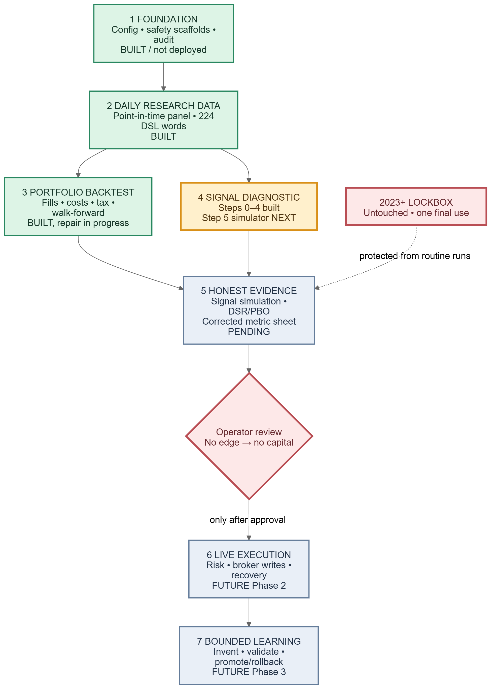
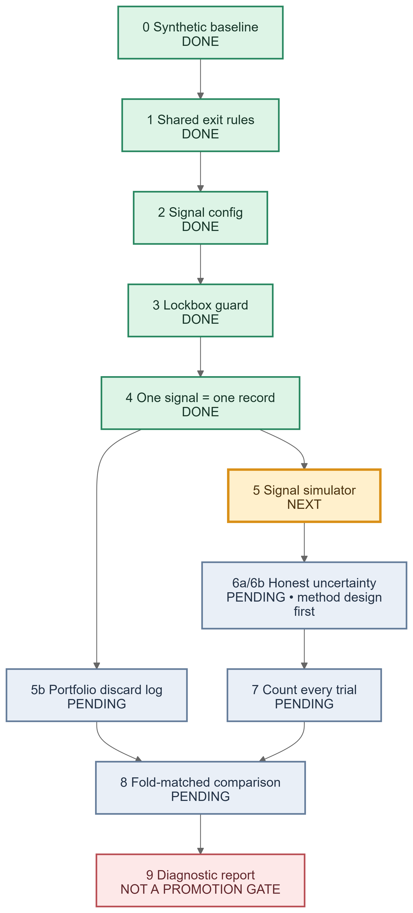
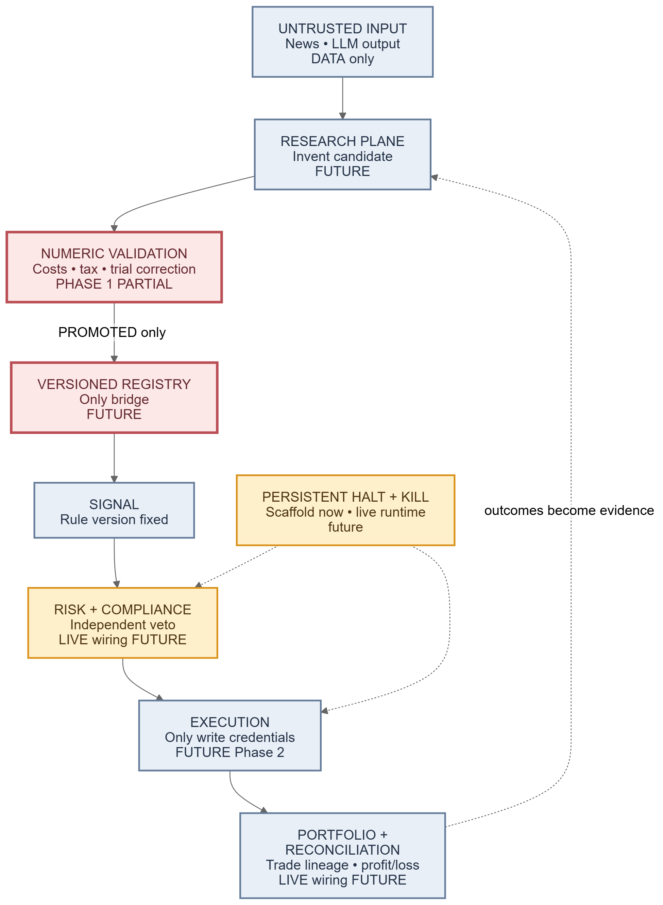

# Icarus documentation map

Start with [STATE.md](STATE.md): it is the current build position and the source of truth for what is complete, in progress, or blocked. Then read [OPERATOR.md](../OPERATOR.md) for working decisions and [TASKS.md](../TASKS.md) for the ordered build and acceptance criteria. [PRD.md](../PRD.md) is the full product and safety specification; [AGENTS.md](../AGENTS.md) is the short safety contract.

## Current work

- [Task 3a plan](plans/2026-08-22-signal-test.md): ordered signal-test work and scope boundaries.
- [Step 4 record contract](plans/2026-09-25-signal-records.md): the specific implementation contract for stable signal identity and one outcome per signal.
- [Trade-lineage and learning proposal](plans/2026-09-24-trade-lineage-learning.md): later work, not current implementation or promotion authority.
- [Newest ranked audit](reviews/2026-08-09-post-backtest-audit.md): known findings, including items not yet scheduled in TASKS.

## Visual map

The three diagrams show the whole system, the current Task 3a zoom-in, and the intended safe feedback loop. Each has an editable `.excalidraw` file, an SVG, and a text `.mmd` source in `diagrams/`.

### Status by layer

### Current Task 3a roadmap

### Intended safe learning loop

Color key: **green = built**, **amber = current work**, **blue = pending/future**, and **red = protected boundary or decision gate**. The status words inside each box are authoritative where colors alone could be ambiguous.

These diagrams are dated snapshots, not acceptance evidence. A colored box marked *built* can still be a research-only or undeployed component; live broker execution is not enabled. Check STATE.md for newer status before relying on a diagram.
